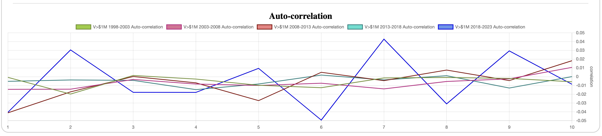

# History and Market Timing: Auto-Correlation of Log-Profits

*Previous: [The Tale of Fat Tails](../powerdist/fat_tails.md)*

## Trading as Conditional Distribution

In trading of all forms and styles, it is a common practice to use various
approaches and tools in the attempt to predict the next market move, and thus,
gain more profit than one would have just by buying and holding the asset for
the same period of time.

In discretionary trading this is often achieved by [technical analysis], that
is, observing and drawing various patterns on the price graph such as "a cup and
a handle" or "head and shoulders". Another way is to use [technical indicators],
which are various numerical manipulations of the price series such as [MACD] or
[RSI], resulting in another time series which is expected to predict, at least
with some probability, the next price move or the next longer term trend.

In a more sophisticated [quantitative analysis] the same feat is achieved
through [momentum] strategies which effectively detect a _trend_ (price is going
up or down over a certain time period) and from that predicting how the price
will behave in the near future, e.g. the next day.

The other large class of quant strategies are based on [mean reversion], that
is, expecting a certain behavior of a stock or a collection of stocks, and when
the expected pattern is broken, the expectation is that the price will go back
to the pattern in the near future. Typically, such pattern is a stable mean for
a linear combination of several stock prices, where a significant departure from
this mean is expected to revert back. Given what
[we already know](../powerdist/students.md#implications-for-log-profits) about
estimating the mean of log-profits, the accuracy of detecting a mean-revertion
property for a portfolio of stocks would be rather low.

In all of these cases save for the mean reversion, the most fundamental
assumption is that historical prices can somehow predict the future price
moves. In statistical terms, and without loss of generality, the _conditional_
distribution of log-profit `f(P(t) | cond(P(t')))` for some set of `t'<t` is
different from the unconditional distribution of log-profit `f(P)`.  And most
notably, its conditional _mean_ `E[P(t) | cond(P(t'))]` is sufficiently
different from the unconditional mean `E[P]` that it can be exploited for
profit. The mean of log-profit effectively represents the average growth rate of
the price, and therefore, a higher conditional mean yields a higher porfolio
growth rate.

The only trick, it seems, is to find the right condition `cond(P(t'))` on
historical data. But does such a condition _exist at all_?

## Testing for (In)Dependence

Besides conditional distribution, statistics also defines the notion of
_independence_: a random variable `X` is _independent_ of another random
variable `Y` if and only if `f(X | Y) = f(X)`. That is, the distribution of `X`
conditioned on the value of `Y` (or any non-degenerate predicate of `Y` for that
matter) is the same as without such a constraint. Intuitively, `X` is random in
exactly the same way regardless of `Y`. Conversely, `X` is _dependent_ on `Y` if
it is _not independent_ of `Y`; that is, `f(X | Y) != f(X)`.

In other words, if the past log-profits `P(t')` happen to be independent from
`P(t)`, any such attempt at timing the market is doomed from the start.
Therefore, it is crucial to check these variables for independence.

A quick (but incomplete) test for independence is [correlation]:

```
Corr(X, Y) = E[(X-E[X]) * (Y - E[Y])] / (sigma(X) * sigma(Y))
```

If `Corr(X, Y) != 0`, we know for sure that `X` and `Y` are _not_ independent,
and the correlation sign suggests in which way `Y` can influence `X`.
Otherwise, even if `Corr(X, Y) == 0`, we only know that the dependence cannot be
linear.

In practice, however, and especially for trading purposes, the dependence we
want to rely on is indeed quite often linear. For example, detecting a "trend"
and expecting that the trend will continue for some time is certainly an example
of a linear dependency. It effectively states that if `P(t-1)+ ... +P(t-1-m) > 0`
(the price over the last `m` steps grew on average), then `P(t)>0` has a higher
probability than `P(t)<0`. This property can be expressed e.g. as:

```
P(t) = (P(t-1)+ ... +P(t-1-m))/m + R
```

where `R` is a random variable with `E[R]=0` representing the remaining
variability around the expected mean growth. Intuitively, it says that the trend
will continue as before, modulo some random noise. Clearly, such dependence is
linear, and therefore, will be detected by correlation.

Therefore, it seems useful to check `Corr(P(t), P(t-k))` for a few values of
`k>0`.  Since this is a correlation of the log-profit sequence with itself, we
call it _auto-correlation_, and since the mean and the standard deviation of
both samples are the same, the formula reduces to:

```
Corr(P(t), P(t-k)) = E[ (P(t) - E[P]) * (P(t-k) - E[P]) ] / Var(P).
```

Note, that correlation effectively normalizes the distribution to `E[X]=0` and
`Var[X]=1`. Thus, it is safe to accumulate correlation from multiple tickers, to
have more samples and more accurate result. More precisely, we'll accumulate

```
S = sum[ (P(t)-E[P]) * (P(t-k) - E[P]) ] / Var(P)
```
and the number of samples `N`. The final correlation is computed as:

```
Corr(P(t), P(t-k)) = S / N.
```

We start by computing the correlation for `k in [1..100]` for all the stocks
whose average daily volume is more than $1M ([config](assets/prices-all.json)):


And the results are not encouraging. At the time of writing (prices up to
January 23, 2023) there are 25,053,614 points used in the correlation from
10,085 tickers. We can see that most of the values hover around 0 rather
closely, within `[-0.01..0.01]`. The only exception is `k=1` whose correlation
is `-0.031`, though it is still rather small.

So, we can tentatively conclude that maybe, just maybe, the price tends to
revert slightly after any move.

But before we make any further conclusions, let's estimate the sample noise by
computing the same correlation for synthetic samples of the same size
([config](assets/synthetic-25M.json)):


Apparently, the noise level at this size is within `+-0.0008`, which is at least
an order of magnitude less than with real prices. However, this assumes that all
the log-profit sequences are completely independent, which is not the case in
the stock market. In fact, as we'll see in later experiments, stocks often move
together with the market overall, and therefore, the noise level is better
represented by a much shorter sequence of 24 years worth of daily data (since
our data source is from 1998), or about 6,000 points
([config](assets/synthetic-6K.json)):


The synthetic noise is a bit larger than the real sample, within `+-0.02`, but
not by much. If we assume that stocks, while correlated among each other, still
have some (small) degree of independence, this may bring the auto-correlation
noise down when averaged across the entire exchange.

We still have a case of `k=1` though. Let's look a bit closer at it now. In
particular, let's see how well it holds up on smaller sample sizes, for
examples, on the classical FAANG stocks ([config](assets/FAANG.json)):


OK, looks like if there is any `k=1` pattern, it only holds for very large
numbers, and no single stock, even over 24 years, is sufficient to expose this
pattern. And how large? Let's slice the liquid stock data into five 5-year time
periods, each containing 4-5M points, and see how this pattern holds across time
([config](assets/by-year.json)):



Apparently, only two time periods out of 5, namely 2008-2013 and 2018-2023
exhibit the "k=1" pattern, but the other three periods do not. 

All in all, this basically seals the fate of any reasonable short term price
prediction based on historical prices. If there is any hope for timing the
market, it must be non-linear.

[technical analysis]: https://en.wikipedia.org/wiki/Technical_analysis
[quantitative analysis]: https://en.wikipedia.org/wiki/Quantitative_analysis_(finance)
[momentum]: https://en.wikipedia.org/wiki/Momentum_(finance)
[technical indicators]: https://en.wikipedia.org/wiki/Technical_indicator
[MACD]: https://en.wikipedia.org/wiki/MACD
[RSI]: https://en.wikipedia.org/wiki/Relative_strength_index
[mean reversion]: https://en.wikipedia.org/wiki/Mean_reversion_(finance)
[correlation]: https://en.wikipedia.org/wiki/Correlation
