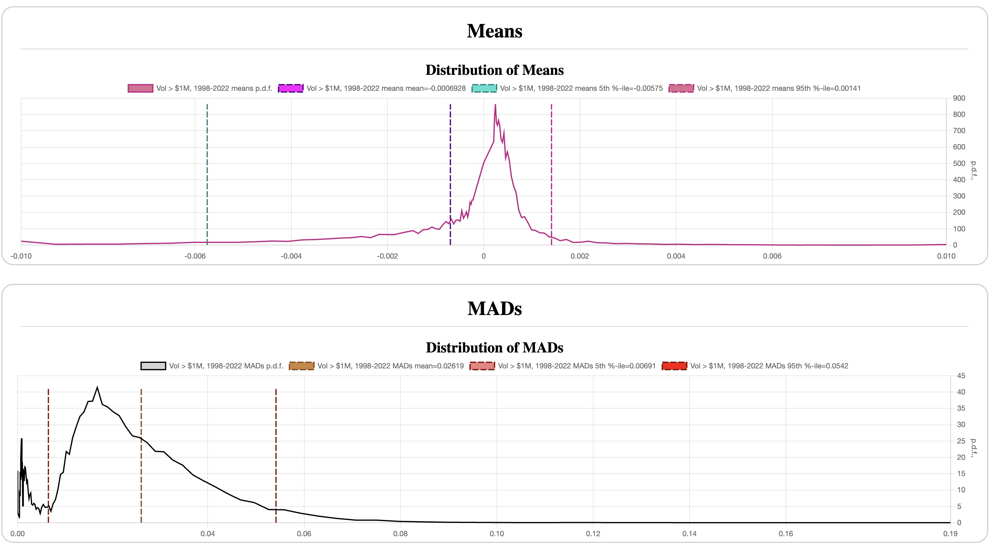

# Distribution of Log-Profits

In the [previous section](../logprofits/) we have defined a quantity `X`
representing log-profits of an equity price series.  Our working hypothesis is
that `X ` is a _random variable_, which means that it can be reasonably
described by a statistical distribution. In this experiment, we are going to
check if such a distribution exists, and how stable it is over time and across
various equities.

## Plotting a distribution

A very simple way to visualize the shape of a continuous distribution from a
given sample, that is to say, it's _p.d.f._ (probability density function), is
to plot a _histogram_ of the samples. Further normalizing the plot so it
integrates to `1.0` yields an approximation of the actual p.d.f.

A histogram is simply a collection of counters respresenting the number of
samples that fall into certain subranges. In the simplest case, we take a range
covering all the samples and divide it evenly into `N` _buckets_. The result for
one of the familiar stocks for `N=101` looks like this, both normalized to
p.d.f. and linear `Y` axis, and the raw counts and log-scale `Y`
([config](assets/GOOG-linear-buckets.json)):


Notice, that most of the action is happening near the center (and I chose an odd
number of buckets to place one bucket exactly in the center), and the counts
drop sharply away from it. The second log-scale plot shows just how sharply they
drop. In particular, the rare but very large price jumps now become visible, and
we can see that about 3/4 of the buckets contain at most one count, and most
buckets contain none.

### Exponential buckets

Note, that the bucket ranges do not have to be of equal size. Since lots of
counts happen in the middle and very little on the periphery, it makes sense to
allocate more buckets closer to the middle, and fewer and wider buckets towards
the extremes. For these experiments, I decided to grow the buckets
geometrically, so that

```
size(bucket[i+1]) = e * size(bucket[i])
```

where `e` is the base of the natural exponent. The coefficient `e` is somewhat
arbitrary, and I simply chose it for convenience. The formula obviously works
only to the right of the center bucket, but the actual implementation makes the
buckets grow in both directions - see the code in [buckets.go] for more detail.

With this change, the two plots now look like this
([config](assets/GOOG-exp-buckets.json)):


The number of useful buckets is now larger, and we can clearly see the sample
noise even very close to the center with dozens of samples in each bucket. Come
to think of it, with 2K samples spread over 101 buckets we get about 20 samples
per bucket, which inevitably leads to a lot of sample noise.

Conclusion so far: we need more data. A _lot_ more.

## Preparing the Data

As I mentioned before, the dataset I use comes from [Nasdaq Data Link], and for
the time period from January 1998 to July 2022 it contains a little over 40M
daily closing prices for over 20K equities that at some point during this period
were listed on the major US stock exchanges (NASDAQ, NYSE and AMEX). This, in
particular, avoids the [survivorship bias], which will become important for us
in the later experiments.

While 40M is certainly a _lot_ more than 2K for a single stock, we cannot yet
use it directly. A quick look at several stocks shows that each has its own
average growth rate and its own average volatility.  This is easy to see on the
graph plotting a sample distribution of log-profits for GOOG and TSLA
([config](assets/GOOG-vs-TSLA.json)), plotted as a `log10(p.d.f.)` to see better
the details in the tails:


However, we are not necessarily concerned with the _exact_ distribution, but
rather its _general shape_. In particular, reading the literature on the subject
I've come across two seemingly contradicting approaches: sometimes the authors
assume that log-profits are distributed _normally_ (as a _normal distribution_
also known as _Gaussian_), and sometimes they talk about a _power distribution_,
which is most often the _Student's T distribution_, or simply _T-distribution_,
often with three degrees of freedom, the parameter I denote as `a=3.0`.  The
justification often goes that, according to the [central limit theorem], a large
enough sum of T-distributed samples with `a > 2` becomes close to the normal
distribution. However, virtually no one mentions _how many_ samples is "large
enough", and this is another generally unstated and certainly unverified
assumption that we will later investigate.

The two distributions are fundamentally different (as we'll see in the later
experiments), and the important question at this stage is to establish once and
for all, which distribution models the stocks best, if at all.

The two distributions are very easy to distinguish from each other when they are
plotted with the same mean and MAD. Therefore, it seems useful to _normalize_
the samples within each stock to have `mean=0.0` and `MAD=1.0`, where each
sample becomes:

```
x' = (x - mean) / MAD
```

Let's try it for the same two stocks above
([config](assets/GOOG-vs-TSLA-normalized.json)):


And voila, the shapes seem to match! Modulo the noise, of course. This is
promising, we may be on to something. Now we are ready to accumulate all the
data for the available stocks into the same histogram and see what happens.  For
comparison, I'm also throwing in the similarly normalized (`mean=0.0`,
`MAD=1.0`) T-distribution graph with `a=3.0`
([config](assets/Distribution-all-stocks-with-samples.json)):


The plot indeed looks very nice, and most interestingly, it follows fairly
closely the T-distribution plot, even if it somewhat underestimates the
thickness of the tails of the sample distribution.

The number of samples in the buckets is fairly high even as far as 30 MADs away
(about 700 samples at +30 and -30 MADs).  Notice the sample noise: it starts to
be noticeable at around 1000 samples, becomes fairly high around 100, and is
completely off the chart around 10. This suggests a rule of thumb: _if a
measurement is obtained from less than 1000 samples, it may be noisy_.

## Is This a Good Model?

However, we still didn't answer the question whether log-profit `X` can be
reasonably modeled by a statistical distribution.

First, the graph above includes _absolutely all_ the US stocks that ever existed
since 1998, and there are many stocks even today that do not trade very often,
not even every day. For those stocks, the log-profits may have a much wider
distribution simply because skipping a few days often results in an abnormally
large jump.

We can filter many such stocks by constraining the average daily _cash volume_
(the number of shares traded in a day times the cost of one share). A stock is
more likely to be trading every day if its volume is fairly large, for instance,
at least $1M/day, which I'm going to call _liquid stocks_
([config](assets/Vol-1M-stocks.json)):


This graph has 24,473,180 samples from 10,281 tickers, or about half of the
database. It also now fits the `a=3.0` T-distribution a lot better, and has a
lot fewer "outliers" that are also not as far away from the mean.

For most practical purposes, these are the stocks we are interested in anyway,
since you probably don't want to invest in a low-volume stock, as it is
difficult to acquire and then often even more difficult to sell due to low
liquidity.

Let's try a few more slices of this dataset and see how this distirbution shape
holds up.  We start with four 6-year slices ([config](assets/by-years.json)):


So far, so good. How about splitting by sector -
([config](assets/by-sectors.json)):


This seems to hold up nicely.  How about across cash volume
([config](assets/by-volume.json)):


OK, so, the same shape seems to be followed rather accurately across time,
sectors, and trading volume, with a tiny caveat that smaller-volume liquid
stocks might have slightly fatter tails. I don't know about you, but if I see
something that looks like a duck, walks like a duck and quacks like a duck, I
have no reason to reject the hypothesis that it's really a duck. Or, in this
case, I cannot reject that `X` is indeed a random variable with a distribution
resembling Student's T with `a=3.0` for liquid US stocks, i.e. with the average
daily cash volume over $1M.

The question of the p-value still remains, but we don't yet have enough
machinery to estimate it accurately for the T-distribution.

## Losers, Winners and Wanderers

In the [previous section](../logprofits) I casually mentioned that stocks
fluctuate daily roughly by 1% of their price. Is this really true?

Let's plot the distribution of means and MADs of daily log-profits, one per each
stock, for all the liquid stocks ([config](assets/means-mads.json)):



The average MAD is `0.02619` (that's 2.6%, not 1%), and the average daily mean
is `-0.0006928`, or `-0.07%` - an average liquid stock is a loser! Note to self:
don't invest in all the liquid stocks in the market equally, as you'd lose about
16% annually.

So, where did I get the impression that the market fluctuates roughly by 1%? As
it turns out, this is the behavor of the _indexes_, such as S&P500 (`0.82%`) or
Nasdaq Composite 100 (`1.1%`) from 1998 till mid-2022. Such indexes are composed
of stocks with the highest market caps, usually weighted by the market cap
itself. Since most of the market in terms of market cap is dominated by
relatively few very large stocks, we may reasonably expect that the largest
stocks indeed fluctuate less and grow a bit better than the average liquid
stock.

And indeed, GOOG (which somewhat resembles NASDAQ Composite 100) has
`mean=0.06808%` (`18.5%` annualized) and `mad=1.164%`, while FAANG stocks (META,
AAPL, AMZN, NFLX, GOOG) jointly have the daily mean of `0.08894%` (`24.9%`
annualized) and MAD `1.814%`. OK, this little mystery is solved.

## What about Normal?

First, let's go back to the overall distribution of all the liquid stocks, and
plot a normal distribution over it ([config](assets/all-stocks-normal.json)):


Woah! OK, so the normal distribution bottoms out at about 40 MADs (simply
because a 64-bit floating point number cannot represent anything smaller than
about `10^-300`), but our sample distribution doesn't even touch `10^-9` as far
as 170 MADs away!

Of course, if we think about it for a moment, even a 10-sigma event for a
normally distributed sample has a 1 out of over `10^23` chance to happen, which
in practice is basically _never_. However, a T-distributed sample with `a=3` can
hit a 10-sigma mark once every 4769 times on average.

To put this in perspective, a typical year has about 250 trading days, so 5K
trading days is about 20 years. This might just explain those "black swans" that
apparently routinely hit Gaussian-based hedge funds (notably, [LTCM]) and a
subsequent "excuse" that it was a "10-sigma event" which, obviously, "should
never happen".

Clearly, the hypothesis that daily log-profits are normally distributed must be
ejected out of the Solar system with the speed of a black hole plasma jet, as
the p-value for the rejection is subatomically small.

As a side note, I momentarily switched to the standard deviation (a.k.a.
_sigma_) just to relate the result back to the "stardand" and often
Gaussian-based trading theories, where sigma, Sharpe ratio and the likes are
routinely used to estimate risk.  For a lot more detail and entertainment, read
"Fooled by Randomness" and "Black Swan" by Nassim Taleb.  And make your own
conclusions.

[survivorship bias]: https://en.wikipedia.org/wiki/Survivorship_bias
[Nasdaq Data Link]: https://data.nasdaq.com/databases/SFB/data
[buckets.go]: https://github.com/stockparfait/stockparfait/blob/main/stats/buckets.go
[central limit theorem]: https://en.wikipedia.org/wiki/Central_limit_theorem
[LTCM]: https://en.wikipedia.org/wiki/Long-Term_Capital_Management
