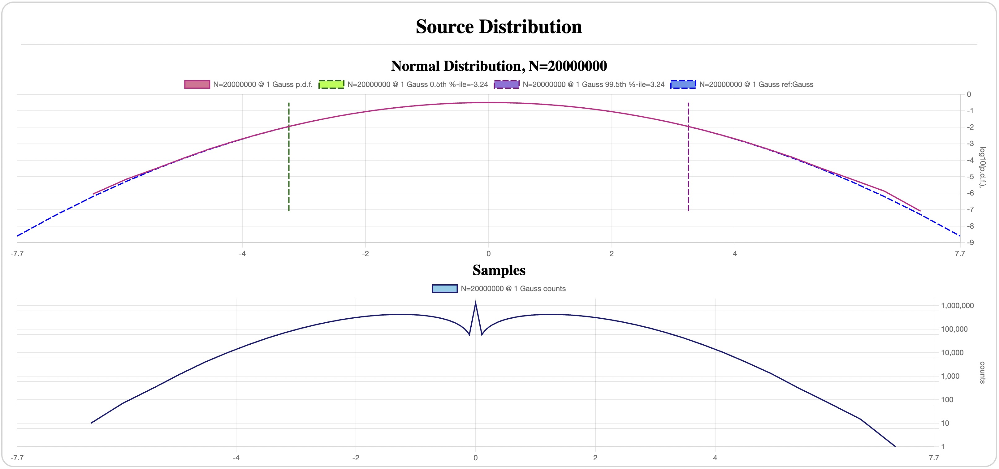
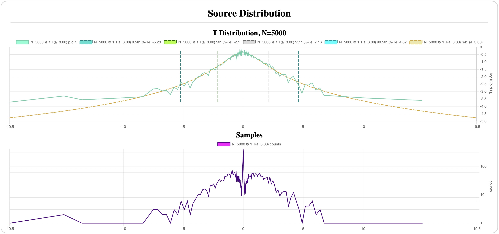
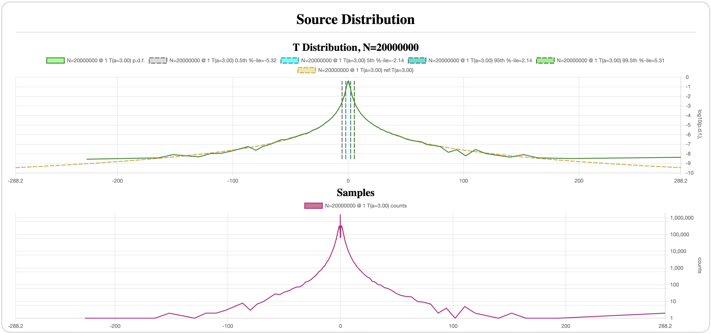

# Hypothesis Testing, Confidence Intervals and Monte Carlo Method

In this experiment, we establish a methodology for working with sampled data and
estimating the precision of the results. Note, that unlike most other
experiments, we will be working exclusively with analytical distributions, and
therefore, will not need any external data.

## Hypothesis Testing and Confidence Intervals

When we compute any statistic or estimate a parameter from sample data, there is always a sampling error. A generally accepted way to estimate such an error is to compute a [confidence interval] for a given _confidence level_ `P`, usually expressed as `p=1-P`, or a _p-value_.

More precisely, given the data samples `x = (x_1, ..., x_n)` of a known
distribution with a parameter `theta` and an interval `[u(x)..v(x)]`, if the
probability that the true value of `theta` is in this interval is `P`, then this
interval is called a _confidence interval_ with the confidence level `P`, or
equivalently, a p-value of `1-P`.

It may be infeasible to obtain a generic confidence interval computationally
using this definition, but we can specialize it to [hypothesis testing].

Specifically, we'll be interested in the case when our null hypothesis states
that the samples are generated using a particular distribution `f(X|theta)` for
a specific `theta`.  An example of such a null hypothesis suggested in the
previous section is that log-profits (normalized to `mean=0` and `MAD=1`) are
distributed as a t-distribution with `a=3`, the alternative hypothesis being
`a!=3`.

In this case, we can construct the following experiment. Under the null
hypothesis, we know the true value of `theta` for the distribution `f(X|theta)`.
Let's sample this distribution to obtain a sample `x=(x_1, ..., x_n)`, and use
an _estimator_ `s(x)` to estimate the value of `theta` from `x`.  This
estimator, in turn, can be viewed as a random variable `S=s(X)` with its own
distribution `g(S|theta)`, which we assume to have a non-degenerate p.d.f.,
finite for any value of `S`.

Next, for a given probability `P`, we construct an interval `I=[theta-u..theta+v]`
such that:

```
u = theta - Q[ (1-P)/2 ]
v = Q[ (1+P)/2 ] - theta
```

where `Q[p]` is a `p`-th quantile of `g(S|theta)`.  By construction, the
probability that `S` falls within this interval is `P`.

Now consider an interval `CI(S)=[S-v, S+u]`. My claim now is that this is
precisely the confidence interval for `theta` with the confidence level `P`
under the null hypothesis.

Indeed, by construction, `S` can be outside of the interval `I` on either side
with equal probability of `(1-P)/2`. When a specific sample `s(x)` is on the
right side of the interval `I`, `s(x) > theta+v`, and hence, `s(x)-v > theta`,
so `theta` is out of `CI(s(x))`. Similarly, when `s(x)` is on the left of
`CI(s(x))` we have that `s(x) < theta-u`, hence `s(x)+u < theta`, and again
`theta` is out of the interval. Conversely, when `s(x)` is within `I`, `theta`
is within `CI(s(x))`. Therefore, `theta` belongs to `CI(S)` with the probability
`P`, hence `CI(S)` is its confidence interval with the confidence level `P`.

Notice, that in this argument `s(x)` does not need to estimate `theta` with any
particular accuracy. However, for practical purposes, it is desirable to have
the mean of `s(X)` approach the actual `theta`, and that the distribution of
`s(X)` is (approximately) symmetric around the mean. If this is the case, then
the confidence interval becomes symmetric around `s(x)`, and we can reasonably
expect that `s(x)` indeed represents an approximation of `theta`.

### Monte Carlo of Confidence Intervals

The above result gives us a way to approximate confidence intervals of various
statistics and parameters of an analytical distribution computationally using a
[Monte Carlo method]:

- Sample `s(x)` by sampling `x=(x_1, ..., x_n)` from `f(X|theta)`;
- Construct a histogram of `s(x)` samples to approximate the p.d.f. of `S`;
- Compute the (approximation of the) interval `I`from the histogram;
- Define `CI(s(x))` as above.

Along the way, we can estimate the quality of the estimator `s(X)` by comparing
its mean to `theta` and evaluating the width of `I` as an indicator of its
precision.

### Mean, MAD and Sigma

As an illustration, our first set of experiments will estimate (computationally)
the basic statistics of our two distributions of interests, t-distribution and
Gaussian.

We start with the mean, MAD and stardand deviation `sigma` for several sample
sizes denoted in the plot by `N`. That is, we draw `N` samples from the source
distribution `x=(x_1, ..., x_N)` and compute the statistics using their
definitions (ignoring the "sample" vs. "population" distinction for `sigma`):

```
mean = sum(x_1, ..., x_N) / N
MAD = sum_N(abs(mean - x_i)) / N
sigma = sqrt( sum_N[ (mean - x_i)^2 ] / N )
```

A value of each statistic becomes a single sample of its own histogram. We then
repeat this process 10K times, so that 1% still contains 100 samples to estimate
a confidence interval of 99% confidence level with a reasonable accuracy.  All
in all, we'll be sampling the distribution `10,000 * N` times for each
statistic.

For uniformity, our source distribution will always have `mean=0` and `MAD=1`,
and t-distribution will usually have `a=3` unless stated otherwise.  We use the
following values of `N`:

- `250` - approximately the number of trading days in a year,
- `5000` - 20 years, the rounded maximum duration of a single stock in our dataset,
- `20,000,000` - the rounded number of daily samples in our dataset for the
  stocks with the average daily volume of `>$1M`.

### Normal Distribution

`N=250` ([config](assets/normal-N-250-mean-mad-sigma.json)):


`N=5000` ([config](assets/normal-N-5K-mean-mad-sigma.json)):


`N=20,000,000` ([config](assets/normal-N-20M-mean-mad-sigma.json) - warning:
long runtime, ~50m on my Macbook Air M1):




A few things to note:

- Sampling the source distribution even 20M times barely has any samples above 7
  MADs; at 5K times it hardly crosses 4 MADs.
- All three statistics converge fairly rapidly with the number samples; the 99%
  confidence interval goes from `+-0.2` for mean at `N=250` to `+-0.045` at
  `N=5K`, and is negligibly small at `N=20M`. In fact, the mean's CI roughly
  equals the theoretically expected `[-3.25..3.25]/sqrt(N)`, where
  `[-3.25..3.25]` is the mean's CI for `N=1`, as shown on the source
  distribution plot.
- Sigma and MAD have approximately the same precision: `+-12%` at `N=250` and
  `+-3%` at `N=5K` for the same 99% confidence level.

### Student's T-Distribution

`N=250` ([config](assets/t-N-250-mean-mad-sigma.json)):


`N=5000` ([config](assets/t-N-5K-all-dist.json)):




`N=20,000,000` ([config](assets/t-N-20M-all-dist.json) - warning:
long runtime, 85m on my Macbook Air M1):




In comparison to the normal distribution, the same points look very different
for the t-distribution with `a=3`:

- Even within 250 samples we are seeing a couple of samples near 6 MADs away
  from the mean; at 5K samples about 50 (1%) lie more than 5 MADs away, some of
  which reach over 12 MADs (which are already practically unreachable for the
  normal distribution), and at 20M there are samples more than 200 MADs
  away.
- Mean and MAD still converge fairly well, even if their 99% CIs are about twice
  as wide as for the normal distribution, but the same `sigma`'s CI is 3x wider
  even for 20M samples, all the while having occasional jumps a whole order of
  magnitude away from its expected value for `N=250` and about 3x its value for
  `N=5K`.

In other words, the standard deviation converges a lot slower and is a lot
noisier than MAD, and hence, I've decided to use MAD rather than `sigma`.
Additionally, MAD is a more intuitive measure of volatility.

## Implications for Log-Profits

Recall that the market on average (as judged e.g. by the NASDAQ Composite index)
has a daily mean of about 3-5% of its MAD. Let's optimistically take the 5%.
This implies that the mean's CI must be no more than +-0.05 (5% of MAD) just to
give an indication whether the price series is rising or falling on average, and
a lot narrower to estimate its actual value.

For a 1-year period, the 99% mean's CI is +-20% of MAD for the normal, and 25%
for the t-distribution, which is too wide to estimate anything useful about the
mean.  In fact, the required +-5% width can only be obtained for a CI with a
confidence level of 45% for the normal, and 40% for the t-distribution, which is
a dubious confidence level to say it nicely.

For a 20-year period, the normal's 99% mean's CI is now a bit below +-5%, but
the t-distribution is closer to +-6%, and the required 5% is obtained by the 98%
confidence level. Once again, this is just to be sure with 98% confidence that
the stock or index actually grows over time, but not to tell how fast.

For reference, a 10-year period achieves the 5% accuracy with 90% confidence for
t-distribution, and the same 90% confidence yields 3.7% accuracy over 20 years,
which might in fact be passable for a practical investor. Note, that assuming 5%
`mean / MAD` ratio for a typical 1% volatility is 0.05% daily growth, which
translates to 3.5% annualized growth, and +-3.7% accuracy is a 90% confidence
that the stock grows between 1.4% and 8.9% annually. I'd say, that's still a
pretty lousy accuracy, even if somewhat reassuring.

Since the normal distribution has comparable ranges for the mean, the precision
and the confidence are not much higher, even if we take a wild chance and decide
to use it as a model.

## The Tale of Fat Tails

Recall that the p.d.f. of the [t-distribution] with `a` degrees of freedom is:

```
t[a](x) = C * (1 + (x^2)/a)^(-(a+1)/2)
```

where `C=Gamma((a+1)/2) / [ sqrt[a*Pi] * Gamma(a/2) ]` is a normalizing
coefficient. The important part is that when the absolute value of `x`
approaches infinity, the p.d.f. becomes proportional to a [power law] with the
exponent `a+1`:

```
t[a](x) [ abs(x) --> Inf] ~  1/ [ abs(x)^(a+1) ]
```

and hence, the c.d.f. (cumulative distribution function) approaches 0 or 1 as a
power law with the exponent `a`. Therefore, a Student's t-distribution is a
[heavy-tailed distribution], since for any `a` it has infinite moments, and for
`a<=3` it is also a [fat-tailed distribution], since its skewness and kurtosis
are infinite.

Therefore, to estimate the parameter `a` of the Student's t-distribution, it is
sufficient to look at the tails far enough away from the mean.  In fact, as we
will see in a moment, this approach yields better accuracy than looking at the
near-mean samples.

### Finding Alpha

In the section on [Distribution of Log-Profits] we estimated `a` by visually
fitting a reference analytical distribution and comparing it to the sample
distribution.  But if we want to estimate the confidence interval of `a` we need
to come up with an automated method for estimating `a`. Perhaps, the simplest
way is to formalize what we informally did before: try a few reference
distributions with different `a` and pick the one which fits the best.  Or, more
accurately, the one that _differs the least_. For that, we need some sort of a
distance measure for distributions.

In most statistics textbooks, such a measure between distributions with p.d.f.'s
`f` and `g` is often defined as the maximum pointwise distance:

```
D_linear(f, g) = max { abs(f(x) - g(x)) } for all x in [-inf..inf]
```

Since our sample p.d.f. is generated as a histogram, it has a fixed number of
points (the values of `x` corresponding to the buckets), and our measure
becomes:

```
D_linear(f, g) = max { abs(f(x) - g(x)) } for all x in histogram's buckets
```

However, such measure heavily favors the points near the mean, since this is
where the value of p.d.f. is the largest, and effectively ignores the tails as
they become very close to zero. As an illustration, let's look at the
t-distributions with `a=2.8` and `a=3.2` plotted with linear scale Y axis
([config](assets/t-a28-vs-a32-linear.json)):


We can clearly see that any meaningful difference is tiny and is mostly within
about 0.5 MAD away from the mean, and the remaining tails are too close to each
other to contribute anything to the distance measure. This creates a situation
when the sample noise in the less important region near the mean may be higher
than the useful signal in the far tails.

However, if we plot the same distributions on a log-scale `Y` axis, the
difference in the tails becomes a lot more significant than near the mean
([config](assets/t-a28-vs-a32-log.json)):


In fact, this is precisely why we've been plotting all the distributions on a
log-scale `Y`, to see the details in the tails.

This gives the idea of a modified measure:

```
D_log(f, g) = max { abs(log(f(x)) - log(g(x))) } for all x in buckets
```

This measure, judging by the plots above, heavily favors the far tails over the
near-mean values.

Thus, an algorithm for finding the best `a` reduces to minimizing the function

```
F(a) = D_log(f_sample, t[a])
```

where `t[a]` is the p.d.f. of a t-distribution with the parameter `a`.

To reduce the sample noise further, this measure can ignore the histogram
buckets with counts less than some threshold `k`. In fact, looking at the few
sample graphs above we can already see that sample p.d.f. points generated by
very few samples (e.g. less than 10) are very noisy, and tend to create an
impression of a "fatter tail" than it really is.

Those of you who actually executed the above configs may have noticed that the
configs for `N=5K` and `N=20M` also include a distribution for "Alpha" - this is
precisely the parameter `a` estimated using the method above.

`N=5K`, `k=10`:


The confidence interval here is too wide to make any meaningful conclusions, and
experimentally `k=10` is about as good as we can get for `N=5K`.  Reducing `k`
exposes us to too much sample noise in the tails, and increasing it cuts the
available tails too short. Clearly, estimating `a` requires more data, and it's
the reason I didn't even try it for `N=250`.

`N=20M`, `k=10`:


`N=20M`, `k=100`:


Here the CIs become a lot more reasonable.  The buckets with 10+ counts appear
around 67 MADs away from the mean, and 100 counts - near 33 MADs, which is still
a respectable distance far into the tails, all the while reducing the sample
noise with higher counts. The result, of course, is a somewhat tighter
confidence interval for `k=100`: around +-1% for 90% confidence, and +-1.7% for
99%, as compared to +-2% and +-4% respectively for `k=10`.

[Distribution of Log-Profits]: ../distribution
[t-distribution]: https://en.wikipedia.org/wiki/Student%27s_t-distribution
[power law]: https://en.wikipedia.org/wiki/Power_law
[heavy-tailed distribution]: https://en.wikipedia.org/wiki/Heavy-tailed_distribution
[fat-tailed distribution]: https://en.wikipedia.org/wiki/Fat-tailed_distribution
[confidence interval]: https://en.wikipedia.org/wiki/Confidence_interval
[hypothesis testing]: https://en.wikipedia.org/wiki/Statistical_hypothesis_testing
[Monte Carlo method]: https://en.wikipedia.org/wiki/Monte_Carlo_method
