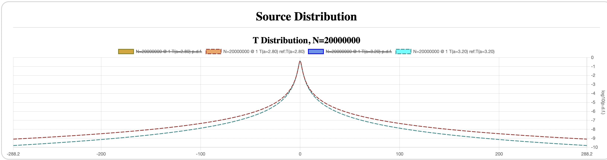
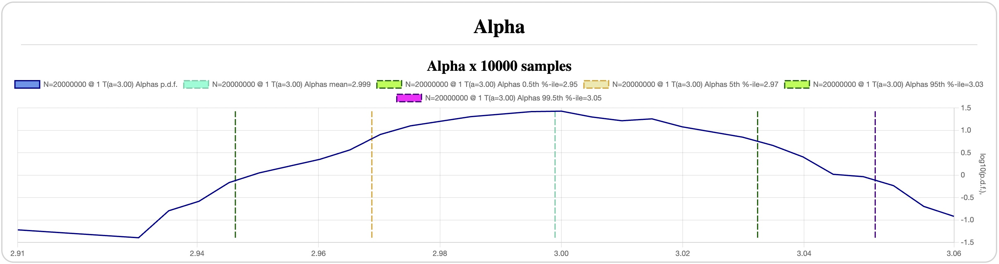

## The Tale of Fat Tails

*Previous: [Student's t-distributoin](students.md)*

Recall that the p.d.f. of the [t-distribution] with `a` degrees of freedom is:

```
t[a](x) = C * (1 + (x^2)/a)^(-(a+1)/2)
```

where `C=Gamma((a+1)/2) / [ sqrt[a*Pi] * Gamma(a/2) ]` is a normalizing
coefficient. The important part is that when the absolute value of `x`
approaches infinity, the p.d.f. becomes proportional to a [power law] with the
exponent `a+1`:

```
t[a](x) [ abs(x) --> Inf] ~  1/ [ abs(x)^(a+1) ]
```

and hence, the c.d.f. (cumulative distribution function) approaches 0 or 1 as a
power law with the exponent `a`. Therefore, a Student's t-distribution is a
[heavy-tailed distribution], since for any `a` it has infinite moments, and for
`a<=3` it is also a [fat-tailed distribution], since its skewness and kurtosis
are infinite.

Therefore, to estimate the parameter `a` of the Student's t-distribution, it is
sufficient to look at the tails far enough away from the mean.  In fact, as we
will see in a moment, this approach yields better accuracy than looking at the
near-mean samples.

### Finding Alpha

In the section on [Distribution of Log-Profits] we estimated `a` by visually
fitting a reference analytical distribution and comparing it to the sample
distribution.  But if we want to estimate the confidence interval of `a` we need
to come up with an automated method for estimating `a`. Perhaps, the simplest
way is to formalize what we informally did before: try a few reference
distributions with different `a` and pick the one which fits the best.  Or, more
accurately, the one that _differs the least_. For that, we need some sort of a
distance measure for distributions.

In most statistics textbooks, such a measure between distributions with p.d.f.'s
`f` and `g` is often defined as the maximum pointwise distance:

```
D_linear(f, g) = max { abs(f(x) - g(x)) } for all x in [-inf..inf]
```

Since our sample p.d.f. is generated as a histogram, it has a fixed number of
points (the values of `x` corresponding to the buckets), and our measure
becomes:

```
D_linear(f, g) = max { abs(f(x) - g(x)) } for all x in histogram's buckets
```

However, such measure heavily favors the points near the mean, since this is
where the value of p.d.f. is the largest, and effectively ignores the tails as
they become very close to zero. As an illustration, let's look at the
t-distributions with `a=2.8` and `a=3.2` plotted with linear scale Y axis
([config](assets/t-a28-vs-a32-linear.json)):


We can clearly see that any meaningful difference is tiny and is mostly within
about 0.5 MAD away from the mean, and the remaining tails are too close to each
other to contribute anything to the distance measure. This creates a situation
when the sample noise in the less important region near the mean may be higher
than the useful signal in the far tails.

However, if we plot the same distributions on a log-scale `Y` axis, the
difference in the tails becomes a lot more significant than near the mean
([config](assets/t-a28-vs-a32-log.json)):



In fact, this is precisely why we've been plotting all the distributions on a
log-scale `Y`, to see the details in the tails.

This gives an idea for a modified measure:

```
D_log(f, g) = max { abs(log(f(x)) - log(g(x))) } for all x in buckets
```

This measure, judging by the plots above, heavily favors the far tails over the
near-mean values.

Thus, an algorithm for finding the best `a` reduces to minimizing the function

```
F(a) = D_log(f_sample, t[a])
```

where `t[a]` is the p.d.f. of a t-distribution with the parameter `a`.

To reduce the sample noise further, this measure can ignore the histogram
buckets with counts less than some threshold `k`. In fact, looking at the few
sample graphs above we can already see that sample p.d.f. points generated by
very few samples (e.g. less than 10) are very noisy, and tend to create an
impression of a "fatter tail" than it really is.

Those of you who actually executed the configs in the
[previous section](students.md) may have noticed that the configs for `N=5K` and
`N=20M` also include a distribution for "Alpha" - this is precisely the
parameter `a` estimated using the method above.

`N=5K`, `k=10` ([config](assets/t-N-5K-all-dist.json)):


The confidence interval here is too wide to make any meaningful conclusions, and
experimentally `k=10` is about as good as we can get for `N=5K`.  Reducing `k`
exposes us to too much sample noise in the tails, and increasing it cuts the
available tails too short. Clearly, estimating `a` requires more data, and it's
the reason I didn't even try it for `N=250`.

`N=20M`, `k=10`:


`N=20M`, `k=100` ([config](assets/t-N-20M-all-dist.json)):



Here the CIs become a lot more reasonable.  The buckets with 10+ counts appear
around 67 MADs away from the mean, and 100 counts - near 33 MADs, which is still
a respectable distance far into the tails, all the while reducing the sample
noise with higher counts. The result, of course, is a somewhat tighter
confidence interval for `k=100`: around +-1% for 90% confidence, and +-1.7% for
99%, as compared to +-2% and +-4% respectively for `k=10`.

[Distribution of Log-Profits]: ../distribution
[t-distribution]: https://en.wikipedia.org/wiki/Student%27s_t-distribution
[power law]: https://en.wikipedia.org/wiki/Power_law
[heavy-tailed distribution]: https://en.wikipedia.org/wiki/Heavy-tailed_distribution
[fat-tailed distribution]: https://en.wikipedia.org/wiki/Fat-tailed_distribution
