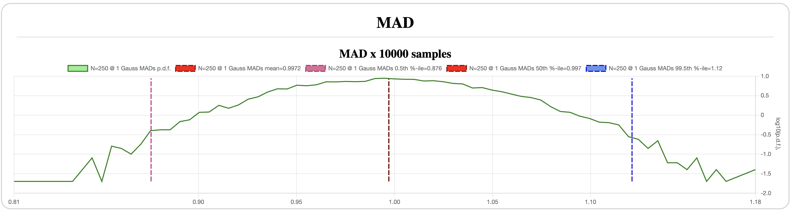
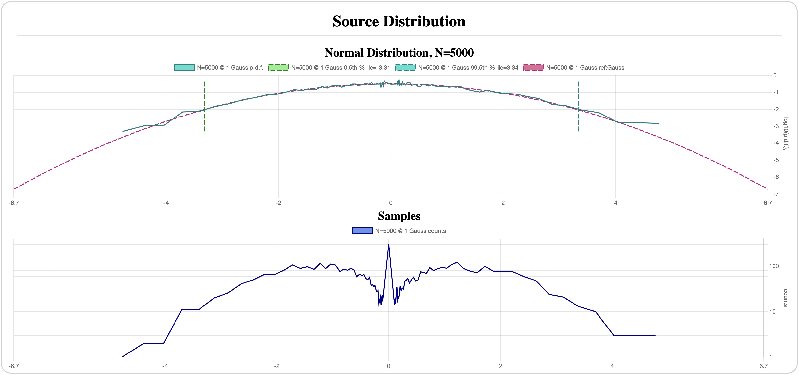

# Normal Distribution

*Previous: [Theory](theory.md)*

`N=250` ([config](assets/normal-N-250-mean-mad-sigma.json)):

`N=5000` ([config](assets/normal-N-5K-mean-mad-sigma.json)):

`N=20,000,000` ([config](assets/normal-N-20M-mean-mad-sigma.json) - warning:
long runtime, ~50m on my Macbook Air M1):

A few things to note:

- Sampling the source distribution even 20M times barely has any samples above 7
  MADs; at 5K times it hardly crosses 4 MADs.
- All three statistics converge fairly rapidly with the number samples; the 99%
  confidence interval goes from `+-0.2` for mean at `N=250` to `+-0.045` at
  `N=5K`, and is negligibly small at `N=20M`. In fact, the mean's CI roughly
  equals the theoretically expected `[-3.25..3.25]/sqrt(N)`, where
  `[-3.25..3.25]` is the mean's CI for `N=1`, as shown on the source
  distribution plot.
- Sigma and MAD have approximately the same precision: `+-12%` at `N=250` and
  `+-3%` at `N=5K` for the same 99% confidence level.

*Next: [Student's t-distribution](students.md)*
