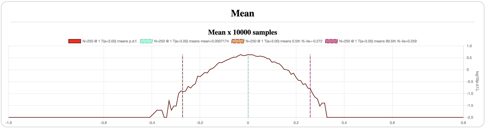
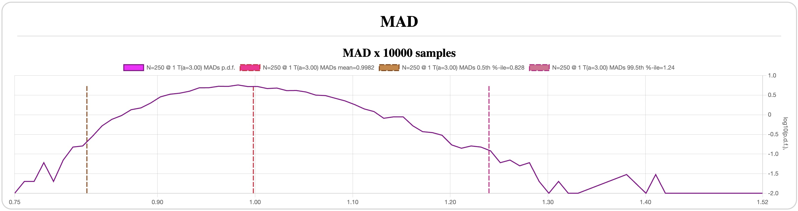
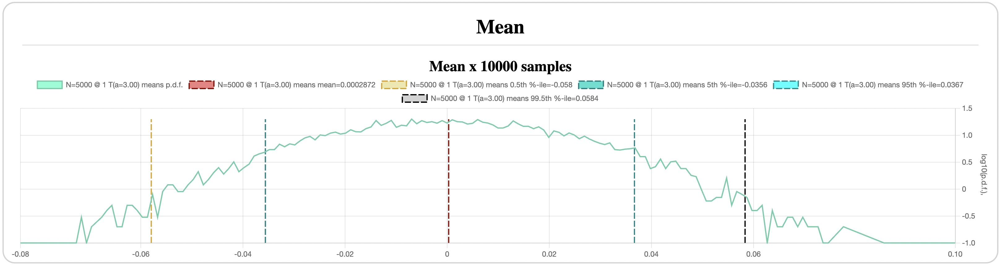
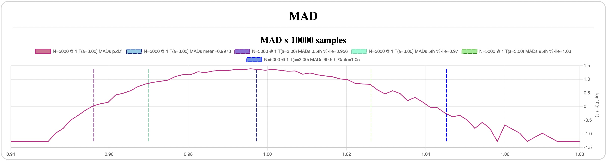
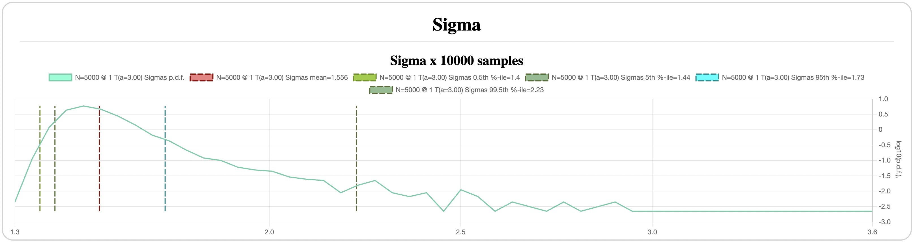
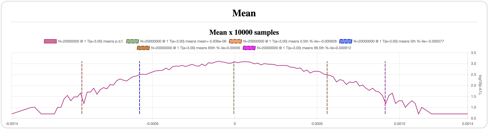
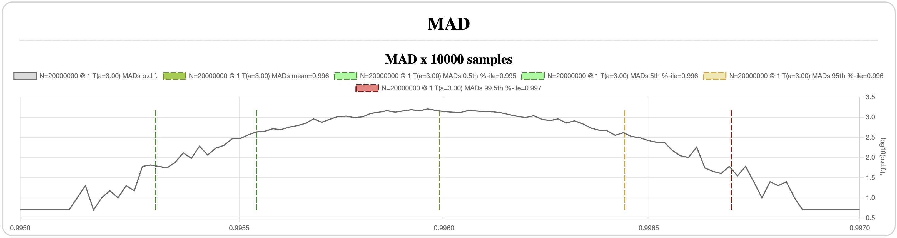

# Student's T-Distribution

*Previous: [Normal distributinon](normal.md)*

`N=250` ([config](assets/t-N-250-mean-mad-sigma.json)):

`N=5000` ([config](assets/t-N-5K-all-dist.json)):

`N=20,000,000` ([config](assets/t-N-20M-all-dist.json) - warning:
long runtime, 85m on my Macbook Air M1):

In comparison to the normal distribution, the same points look very different
for the t-distribution with `a=3`:

- Even within 250 samples we are seeing a couple of samples near 6 MADs away
  from the mean; at 5K samples about 50 (1%) lie more than 5 MADs away, some of
  which reach over 12 MADs (which are already practically unreachable for the
  normal distribution), and at 20M there are samples more than 200 MADs
  away.
- Mean and MAD still converge fairly well, even if their 99% CIs are about twice
  as wide as for the normal distribution, but the same `sigma`'s CI is 3x wider
  even for 20M samples, all the while having occasional jumps a whole order of
  magnitude away from its expected value for `N=250` and about 3x its value for
  `N=5K`.

In other words, the standard deviation converges a lot slower and is a lot
noisier than MAD, and hence, I've decided to use MAD rather than `sigma`.
Additionally, MAD is a more intuitive measure of volatility.

## Implications for Log-Profits

Recall that the market on average (as judged e.g. by the NASDAQ Composite index)
has a daily mean of about 3-5% of its MAD. Let's optimistically take the 5%.
This implies that the mean's CI must be no more than +-0.05 (5% of MAD) just to
give an indication whether the price series is rising or falling on average, and
a lot narrower to estimate its actual value.

For a 1-year period, the 99% mean's CI is +-20% of MAD for the normal, and 25%
for the t-distribution, which is too wide to estimate anything useful about the
mean.  In fact, the required +-5% width can only be obtained for a CI with a
confidence level of 45% for the normal, and 40% for the t-distribution, which is
a dubious confidence level to say it nicely.

For a 20-year period, the normal's 99% mean's CI is now a bit below +-5%, but
the t-distribution is closer to +-6%, and the required 5% is obtained by the 98%
confidence level. Once again, this is just to be sure with 98% confidence that
the stock or index actually grows over time, but not to tell how fast.

For reference, a 10-year period achieves the 5% accuracy with 90% confidence for
t-distribution, and the same 90% confidence yields 3.7% accuracy over 20 years,
which might in fact be passable for a practical investor. Note, that assuming 5%
`mean / MAD` ratio for a typical 1% volatility is 0.05% daily growth, which
translates to 3.5% annualized growth, and +-3.7% accuracy is a 90% confidence
that the stock grows between 1.4% and 8.9% annually. I'd say, that's still a
pretty lousy accuracy, even if somewhat reassuring.

Since the normal distribution has comparable ranges for the mean, the precision
and the confidence are not much higher, even if we take a wild chance and decide
to use it as a model.

* Next: [The Tale of Fat Tails](fat_tails.md)*
